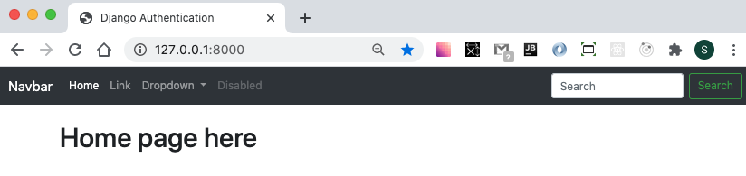
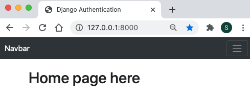
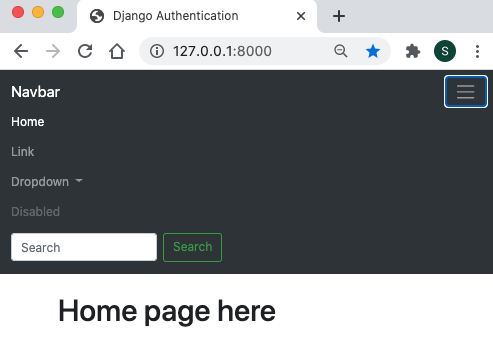
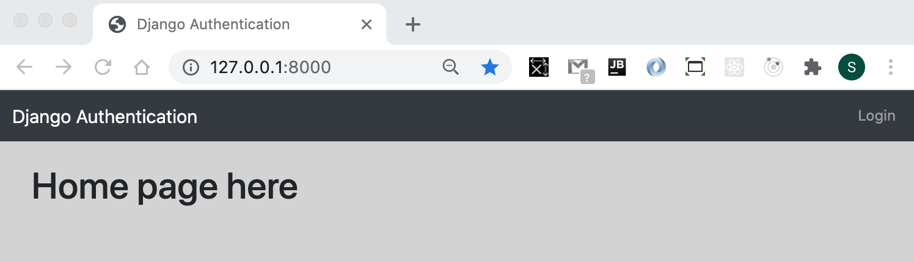

Django Authentication

#### Project Setup
1) Setup virtual environment

~~~ bash
python3 -m venv v_auth
~~~

2) Activate virtual environment

~~~ bash
source v_auth/bin/activate
~~~

- `pip freeze` should show nothing since only virtual env was created, nothing installed

3) Install Django

- within virtual environment activated...
- 
~~~ bash
pip install django
~~~

4) Create my_site directory, cd into `my_site`, and then create `my_site` project in that directory. The `.` at the end installs everything in the current directory

~~~ bash
django-admin startproject mysite .
~~~

5) Test that server launches by running `python manage.py runserver` and running port `http://127.0.0.1:8000/`
- ignore migration error messages

6) Run `python manage.py migrate` to apply initial migrations 

7) Create an admin superuser so that the admin panel can be accessed
- Run  `python manage.py createsuperuser`
- leaving Username blank just uses current user

8) Verify admin panel can be reached by going to `http://127.0.0.1:8000/admin/`

#### App Setup

1) Create the `authenticate` app from within virtual environment

    ~~~ bash
    python manage.py startapp authenticate
    ~~~

2) Add `authenticate` app to the `INSTALLED_APPS` section of `settings.py`

    ~~~ py
    INSTALLED_APPS = [
        'authenticate',
        'django.contrib.admin',
        'django.contrib.auth',
    ~~~

3) Create a `urls.py` inside the `authenticate` folder

    ~~~ py
    from django.urls import path

    urlpatterns = [
        path(),
    ]
    ~~~

4) Add a link to the app `urls.py` into the project `urls.py`
   - add the `include` import
   - add a path to the authenticate root directory ( we do not need '/')

   ~~~ py
   from django.contrib import admin
   from django.urls import path, include

   urlpatterns = [
       path('admin/', admin.site.urls),
       path('', include('authenticate.urls'))
   ]
   ~~~

#### Build Home page

1) Create directory structure `authenticate/templates/authenticate`

2) Add `home.html`
- this is very basic just to make sure it is set up correctly

    ~~~ html
    <h1> Home page here </h1>
    ~~~

3) Update `views.py`

    ~~~ py
    from django.shortcuts import render

    # Create your views here.
    def home(request):
        return render(request, 'authenticate/home.html', {})
    ~~~

4) Update `urls.py` in `authenticate` app

    ~~~ py
    from django.urls import path
    from . import views

    urlpatterns = [
    path('', views.home, name = "home") 
    ]
    ~~~

5) Update `urls.py` in `my_site` project

    ~~~ py
    from django.contrib import admin
    from django.urls import path, include

    urlpatterns = [
        path('admin/', admin.site.urls),
        path('', include('authenticate.urls'))
    ]
    ~~~

6) Create `base.html` inside `authenticate` folder
   - a large part of this is copied from the `starter` template at <a href = "https://getbootstrap.com/docs/4.5/getting-started/introduction/" > Bootstrap </a>
   ~~~ html
   <!doctype html>
   <html lang="en">
     <head>
       <!-- Required meta tags -->
       <meta charset="utf-8">
       <meta name="viewport" content="width=device-width, initial-scale=1, shrink-to-fit=no">

       <!-- Bootstrap CSS -->
       <link rel="stylesheet" href="https://stackpath.bootstrapcdn.com/bootstrap/4.5.0/css/bootstrap.min.css" integrity="sha384-9aIt2nRpC12Uk9gS9baDl411NQApFmC26EwAOH8WgZl5MYYxFfc+NcPb1dKGj7Sk" crossorigin="anonymous">

       <title>Hello, world!</title>
     </head>
     <body>
     
    

        
        
    

       <!-- Optional JavaScript -->
       <!-- jQuery first, then Popper.js, then Bootstrap JS -->
       
       
       
     </body>
   </html>
   ~~~

7) Update the `home.html` to use the `base.html`   

    ~~~ py
    
    

    <h1> Home page here </h1>

    
    ~~~

#### Building Navbar

- any page that extends `base.html` will contain the navbar

1) Add the following to `base.html`

    - note that dark mode is used in the `nav` tag

        ~~~ html
            <nav class="navbar navbar-expand-lg navbar-dark bg-dark">
                <a class="navbar-brand" href="#">Navbar</a>
                <button class="navbar-toggler" type="button" data-toggle="collapse" data-target="#navbarSupportedContent" aria-controls="navbarSupportedContent" aria-expanded="false" aria-label="Toggle navigation">
                    
                </button>

                

                    <ul class="navbar-nav mr-auto">
                    <li class="nav-item active">
                        <a class="nav-link" href="#">Home (current)</a>
                    </li>
                    <li class="nav-item">
                        <a class="nav-link" href="#">Link</a>
                    </li>
                    <li class="nav-item dropdown">
                        <a class="nav-link dropdown-toggle" href="#" id="navbarDropdown" role="button" data-toggle="dropdown" aria-haspopup="true" aria-expanded="false">
                        Dropdown
                        </a>
                        

                        <a class="dropdown-item" href="#">Action</a>
                        <a class="dropdown-item" href="#">Another action</a>
                        

                        <a class="dropdown-item" href="#">Something else here</a>
                        

                    </li>
                    <li class="nav-item">
                        <a class="nav-link disabled" href="#" tabindex="-1" aria-disabled="true">Disabled</a>
                    </li>
                    </ul>
                    <form class="form-inline my-2 my-lg-0">
                    <input class="form-control mr-sm-2" type="search" placeholder="Search" aria-label="Search">
                    <button class="btn btn-outline-success my-2 my-sm-0" type="submit">Search</button>
                    </form>
                

            </nav>
        ~~~

    - full navbar

        

    - responsive collapsed

        

        - responsive with expanded
        - notice that the button outline persists 

        

2) Override the button outline of `Bootstrap` using the added `static file` 

   - create a new css file `static/css/custom.css` within the `authentication` app
     
   - add to `custom.css`

   ~~~ css
        .buttonOutline button {
            outline-style: none;
        }

        body {
            background: lightgray;
   ~~~

    - add to the top of `base.html`
        - this tells `Django` to look for any static files

    ~~~ html
        
    ~~~

    - add to the bottom of the `head` section of `base.html`

    ~~~ html
            <!-- Custom CSS to override Bootstrap -->
            <link href = "" rel = "stylesheet">
        </head>
    ~~~

3) Modify navbar to show `Authentication` and the `disabled link`

   - note that there are 2 ways we can comment out sections of code

        - `traditional HTML comment notation` 
        ~~~ html
            <!--
            <li class="nav-item active">
                <a class="nav-link" href="#">Home (current)</a>
            </li>
            -->
        ~~~

        - `Dango template tags` that also allow a note to added for further info

        ~~~ html
             <form class="form-inline my-2 my-lg-0">
            <input class="form-control mr-sm-2" type="search" placeholder="Search" aria-label="Search">
            <button class="btn btn-outline-success my-2 my-sm-0" type="submit">Search</button>
            </form> 
        ~~~

    - modify `Navbar` link

        - name of link is changed
        - link points to `home` as it is referenced in `urls.py` in the app `path('', views.home, name = "home")`

        ~~~ html
        <a class="navbar-brand" href = " ">Django Authentication</a>
        ~~~

    - rename `Disabled` link and have move it be on right side of nav bar be changing `mr-auto` to `ml-auto`

        ~~~ html
        

                    <ul class="navbar-nav ml-auto">

        ~~~

    - the nav bar should now look like this

    

#### Login Form

1) 